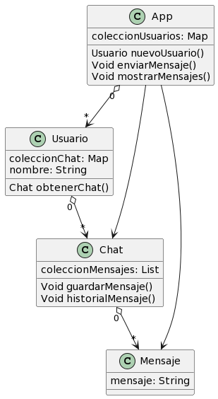

#  Ejercicio de objetos - CHAT

Cree cuatro clases diferentes, App que se encarga de manejar las interacciones.
App contiene una coleccion de usuarios.

La clase usuarios contiene una coleccion de chat (porque puede hablar con multiples usuarios).
La clase Chat contiene una Lista de Mensajes, para que queden ordenados de manera secuencial.

---

